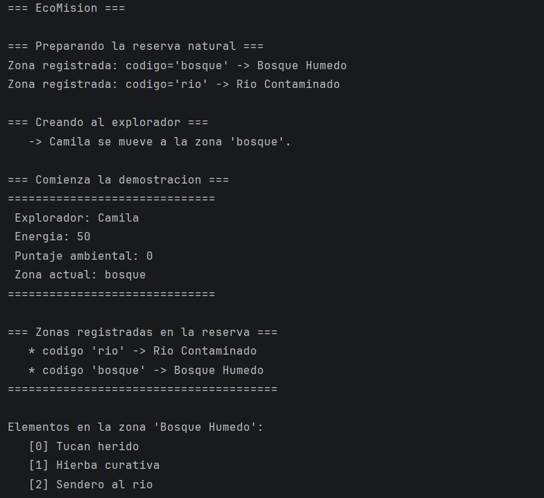
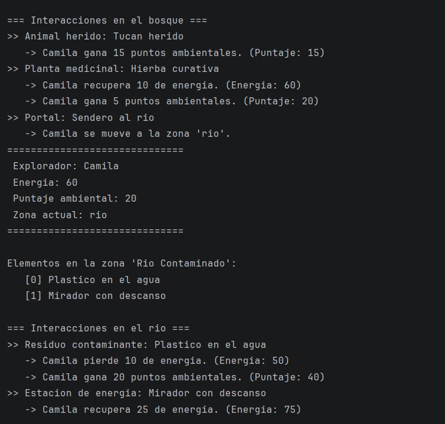
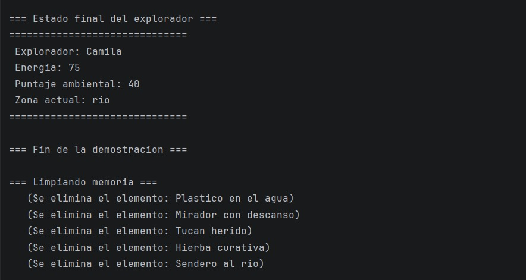

## Nombre del proyecto

**EcoMisión** — Prototipo de consola en C++ para una experiencia interactiva
sobre cuidado ambiental.

---

## Integrantes
- Maria Camila Giraldo Ceballos
- Santiago Josue Garcia Ampudia

## Descripción breve
En EcoMisión, una persona exploradora recorre una reserva natural
compuesta por varias zonas (bosque húmedo, río contaminado, etc.). En cada
zona encuentra elementos interactivos con los que puede interactuar:

🐦 Animal herido → curarlo da puntaje ambiental.
🌿 Planta medicinal → recolectarla da energía y puntaje.
🗑️ Residuo contaminante → limpiarlo cuesta energía, pero da puntaje.
🚪 Portal de ruta → mueve al explorador a otra zona.
🔋 Estación de energía → recarga la energía del explorador.

Toda la experiencia la coordina una clase central llamada `EcoMision`, y el
`main` es muy pequeño: solo le delega el trabajo a esa clase.
 
El proyecto practica los **cuatro pilares de la POO** (abstracción,
encapsulamiento, herencia y polimorfismo), muestra distintos tipos de
**relaciones** entre clases (asociación, agregación), aplica **sobrecarga** y
**sobreescritura**, y usa **`std::unordered_map`** para administrar las zonas
por código.
## Cómo compilar o ejecutar
Descomprime el ZIP.
Abre CLion → File → Open → selecciona la carpeta EcoMision (la que tiene el CMakeLists.txt adentro, NO un archivo suelto).
CLion lee el CMakeLists.txt automáticamente, configura el proyecto, y luego solo le das al botón verde ▶ (Run) o presionas Shift + F10.

Eso es todo. CLion compila y ejecuta solo. No escribes ningún comando en la terminal.
## Archivos principales del proyecto
| Archivo | Descripción |
|---|---|
| `main.cpp` | Punto de entrada. Crea un `EcoMision` y llama a `iniciar()` |
| `include/EcoMision.h,scr/Reserva.cpp` | C Clase coordinadora. Prepara la reserva, crea el explorador y ejecuta la demostración. |
| `include/Reserva.h` / `src/Reserva.cpp` |  Administra las zonas con un `std::unordered_map`|
| `include/Zona.h` / `src/Zona.cpp` | Un lugar de la reserva. Guarda elementos (agregación) y tiene el método **sobrecargado** `interactuarCon()`. |
| `include Explorador.h` / `src/Explorador.cpp` | La persona que recorre. Estado: energía, puntaje, zona actual. |
| `include ElementoInteractivo.h` / `src/ElementoInteractivo.cpp` | Clase abstracta base. Define el método virtual puro `interactuar()`.  |
| `include ElementoInteractivos/*.h / src/ElementoInteractivo/*.cpp` |  Las cinco clases hijas (`AnimalHerido`, `EstacionEnergia`, `ResiduoContaminante`, `PortalDeRuta`, `PlantaMedicinal`), cada una en su propio archivo.  |
| `diseno.md` | Tres versiones del diagrama de clases en UML (Mermaid) + matriz de decisiones de diseño. |
| `bitacora-ia.md` | Cómo usamos IA generativa de forma responsable: para qué, qué aceptamos, qué rechazamos. |
| `sustentacion.md` | Guía para la sustentación individual: flujo del programa, preguntas probables y cambios en vivo. |
 
##  Imágenes del proyecto funcionando

### Captura 1 — Inicio

En esta primera parte se ve:
 
- La bienvenida del programa.
- El registro de las **dos zonas** en la reserva (`bosque` y `rio`) usando
  códigos como clave del `unordered_map`.
- La **creación del explorador** (Camila) y su ubicación en la zona inicial.
- El estado inicial del explorador y los elementos disponibles en el bosque.
### Captura 2 

Aquí se demuestra **polimorfismo y sobrecarga** en acción:
 
- Camila interactúa con el **animal herido** (clase `AnimalHerido`): gana
  **+15 puntaje**.
- Recolecta la **planta medicinal** (clase `PlantaMedicinal`): gana
  **+10 energía y +5 puntaje**.
- Cruza el **portal** (clase `PortalDeRuta`): se mueve a la zona `rio`.
Luego se muestran las interacciones en el río: limpia un **residuo
contaminante** (cuesta energía, da puntaje) y recarga en una **estación de
energía**.
### Captura 3 — Estado final

 
En la última parte se ve:
 
- El **estado final** de Camila (energía 75, puntaje 40, zona río).
- La **cadena de destrucción** de objetos al terminar el programa, demostrando
  que la memoria se libera correctamente (responsabilidad de los destructores).