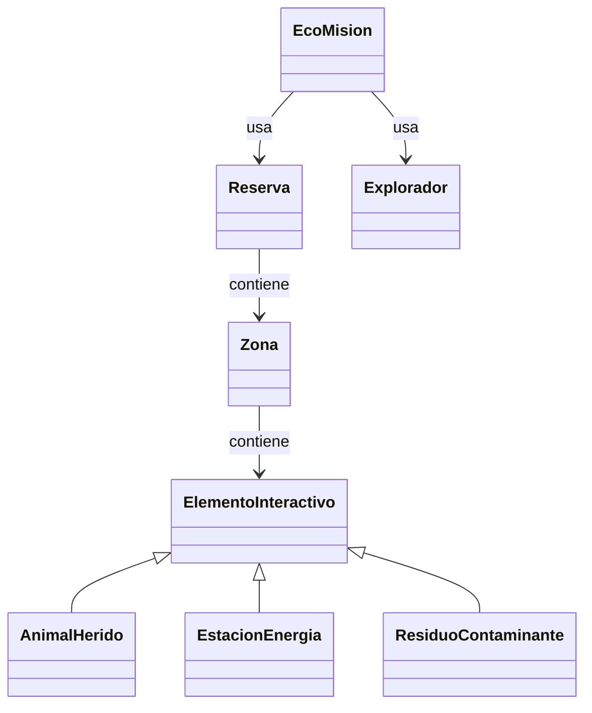
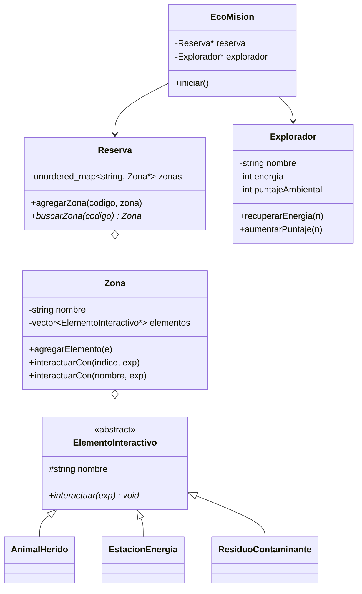
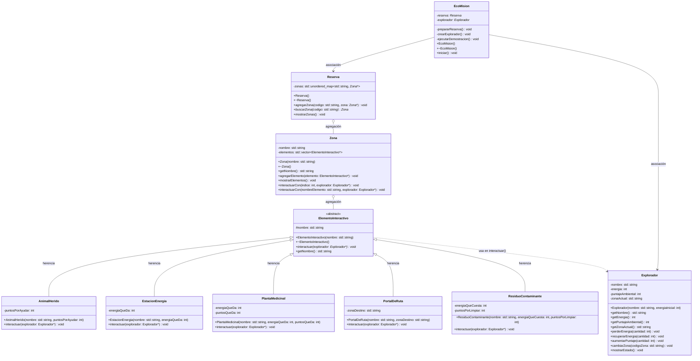

# Documento de diseño — EcoMisión

Este documento muestra cómo evolucionó el diseño del sistema y explica las
decisiones más importantes. Incluye **tres versiones** del diagrama de clases:
inicial (antes de programar), ajustada (mientras programábamos) y final
(producto terminado).

---

## 1. Versión inicial (antes de programar)

Primera idea sobre el papel. Identificamos las clases principales y las
relaciones básicas, sin detallar todavía atributos ni métodos.

Dudas que teníamos en este punto:

- ¿Cómo guardar las zonas dentro de la Reserva? (¿lista, mapa?)
- ¿Cuántas clases hijas de `ElementoInteractivo` necesitamos? (mínimo 3)
- ¿Dónde poner la sobrecarga?

---

## 2. Versión ajustada (después de empezar a programar)

Al programar, decidimos:

- Usar `std::unordered_map<string, Zona*>` en la `Reserva`, porque buscamos
  zonas **por código**.
- Que `Zona` guarde los elementos como `vector<ElementoInteractivo*>` para
  poder usar **polimorfismo**.
- Poner la **sobrecarga** en `Zona::interactuarCon()` (por índice y por nombre).

---

## 3. Versión final (después de terminar)

Diagrama completo del código entregado. Agregamos dos clases hijas más
(`PortalDeRuta` y `PlantaMedicinal`) para enriquecer la demostración, y
detallamos los métodos clave.

## 4. Matriz de decisiones de diseño

| Decisión | Alternativas consideradas | Decisión final | Justificación | Riesgo si se modela mal |
|---|---|---|---|---|
| Cómo representar las zonas | vector, matriz, `unordered_map` | `unordered_map` | La reserva busca zonas **por código**; el mapa hace esa búsqueda directa y rápida. | Se complica la búsqueda o se mezcla con lógica de tablero. |
| Relación Reserva–Zona | Composición vs agregación | Agregación (`Zona*`) | La reserva agrupa zonas y las administra; guardar punteros permite polimorfismo y flexibilidad. | Memoria mal liberada o acoplamiento excesivo. |
| Relación Zona–Elemento | Guardar objetos vs guardar punteros | Punteros `ElementoInteractivo*` | Sin punteros NO hay polimorfismo (perderíamos el tipo real del objeto). | Se pierde el polimorfismo (problema de "object slicing"). |
| Jerarquía de elementos | Una sola clase con un "tipo" (int/enum) | Clase abstracta + herencia | Cada elemento cambia por **comportamiento**, no solo por datos; la herencia lo expresa mejor. | Código lleno de `if/switch` difícil de mantener y extender. |
| Dónde poner la sobrecarga | En Zona vs en Explorador | En `Zona::interactuarCon()` | Es natural interactuar con un elemento por índice o por nombre desde la zona. | Sobrecarga forzada o poco útil. |
| Cómo coordinar todo | Lógica en `main` vs clase central | Clase `EcoMision` | El `main` queda pequeño y la responsabilidad de coordinar está en un solo lugar. | `main` gigante, difícil de leer y probar. |

---

